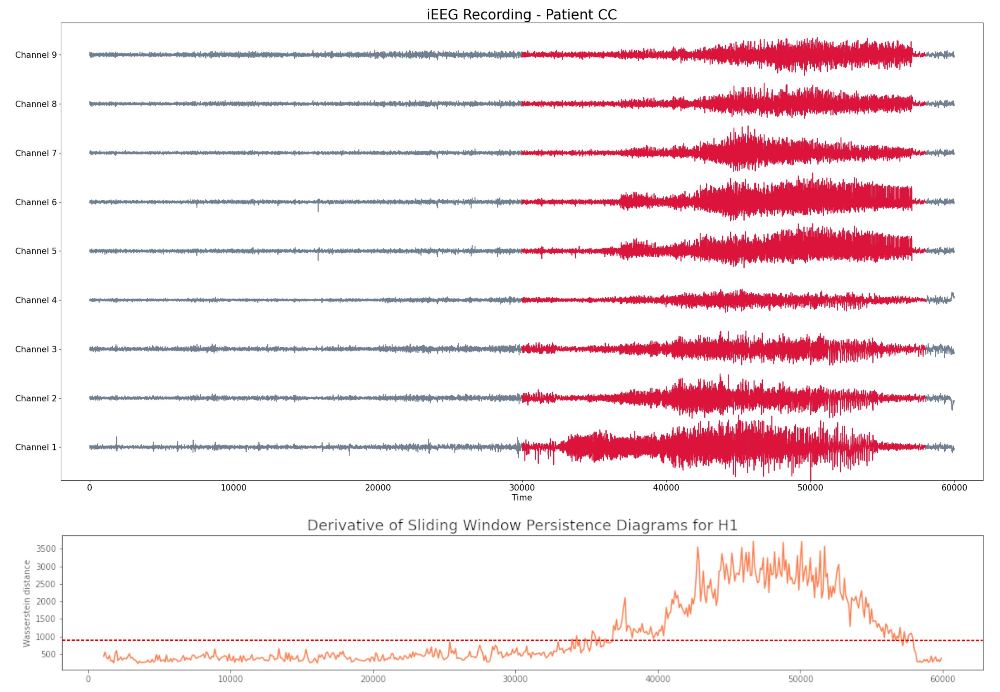

# Topological analysis of epileptic seizures 

We perform the the analysis of the recording of the preictal and ictal states of patients CC, MAC y RAO (data from Western Toronto Hospital). We use techniques derived from Topological Data Analysis and Dynamics.

The details of the methods can be found in the article ['Topological biomarkers for real-time detection of epileptic seizures.'](https://arxiv.org/abs/2211.02523)

A short presentation of the main ideas can be found [here](https://ximenafernandez.github.io/reveal.js-presentations/slides/Epilepsy.html#/).

